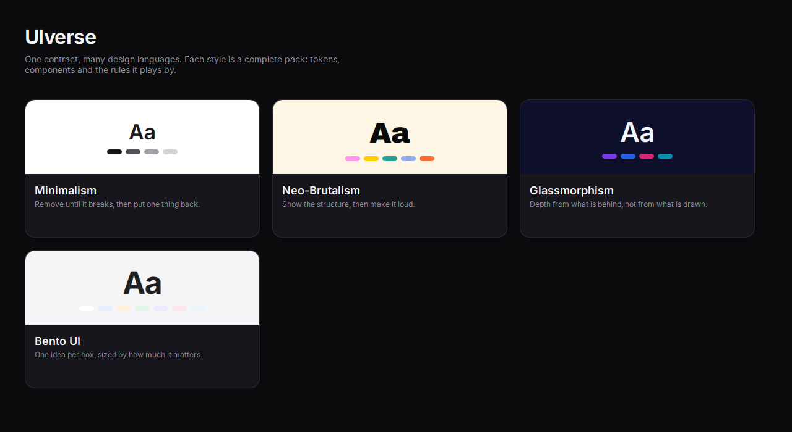
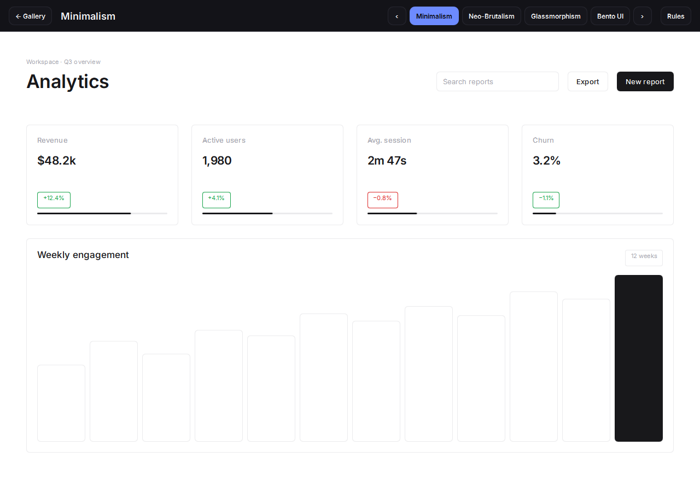
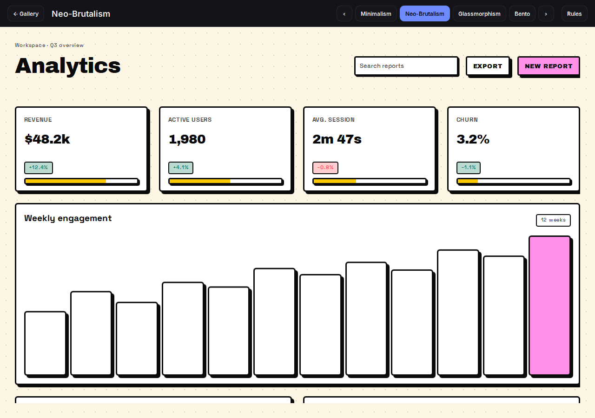
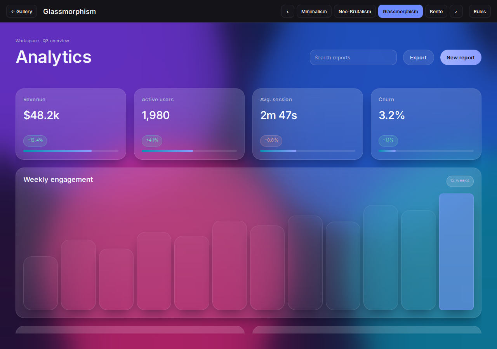
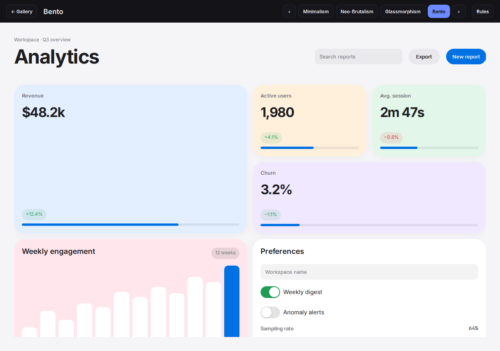

# UIverse

[](https://github.com/MohsenD98/UIverse/actions/workflows/ci.yml)
[](https://github.com/MohsenD98/UIverse/releases/latest)

A playground for UI design styles, built with Qt Quick.

Each style has its own colors, fonts, shapes and way of drawing every widget.
The same small dashboard is drawn in all of them, and you can switch between
styles while the app is running.

[Try it in the browser](https://mohsend98.github.io/UIverse/) ·
[Download](https://github.com/MohsenD98/UIverse/releases/latest)



## Styles

| Minimalism | Neo-Brutalism |
|:---:|:---:|
|  |  |
| Type and whitespace do the work. One accent color. | Thick black borders, hard shadows, loud colors. |
| **Glassmorphism** | **Bento** |
|  |  |
| Frosted panels over a moving background. The blur is real. | Same widgets, laid out as tiles of different sizes. |

More are on the way: neumorphism, skeuomorphism, Y2K, cyberpunk and a few others.

## How it works

The widgets in `kit/` handle input and state but don't draw anything. Each
style in `styles/` supplies the drawing for every widget, along with its
colors and fonts. Switching styles swaps which one is active, and everything
on screen redraws.

Qt Quick Controls has its own styling system, but a style there can't be
changed once the app has started, so this project doesn't use it.

## Building

You need Qt 6.8 or newer, CMake and Ninja.

```sh
cmake -S . -B build -G Ninja -DCMAKE_PREFIX_PATH=<path to Qt>
cmake --build build
```

To save a style as a PNG without opening a window:

```sh
build/uiverse-snapshot --pack glassmorphism --out glass.png
```

## Contributing

Formatting and a few project rules are checked by pre-commit hooks:

```sh
pip install pre-commit
pre-commit install
```

CI runs the same checks plus qmllint, then builds for Windows, macOS, Linux
and the web.

## License

MIT. The fonts in `fonts/` (Inter, Archivo Black, Space Grotesk and
JetBrains Mono) keep their own OFL licenses.
