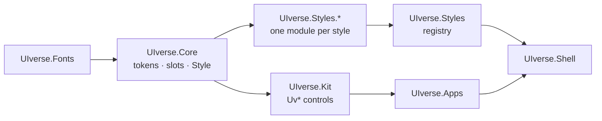

<div align="center">

# UIverse

**A Qt Quick style lab: one design-system contract, many design languages.**

[](https://github.com/MohsenD98/UIverse/actions/workflows/ci.yml)
[](https://github.com/MohsenD98/UIverse/releases/latest)

[](LICENSE)


[**Live demo**](https://mohsend98.github.io/UIverse/) ·
[**Download**](https://github.com/MohsenD98/UIverse/releases/latest) ·
[How it works](#how-it-works)


</div>

## Why

Most "theme" demos swap colours and corner radii. Design languages differ in
much more than that: density, hierarchy, depth, typography and layout.
UIverse implements each one as a complete **style pack** against a shared
contract, then renders the same reference app in every pack so the
differences can be compared honestly — and switched live.

Every pack also ships the rules it plays by: what to do, what to avoid, and
where to read more.

## The styles

| Minimalism | Neo-Brutalism |
|:---:|:---:|
|  |  |
| Hierarchy through space and type alone. One accent, hairlines, no depth. | Thick outlines, hard offset shadows, loud flat colour. Pressing sinks into the shadow. |
| **Glassmorphism** | **Bento UI** |
|  |  |
| Real backdrop blur over an animated aurora, not a translucent fill. | The same components, re-laid out as a grid of tiles sized by importance. |

Next in line: neumorphism, claymorphism, skeuomorphism, material, Y2K, retro,
cyberpunk and editorial.

## How it works



- **Tokens** are the whole design vocabulary — colour roles, geometry,
  typography, surface treatment, motion and *layout personality*.
- **The Kit never paints.** `UvButton`, `UvSlider` and friends are built on
  `QtQuick.Templates` and only provide behaviour. Every pixel comes from the
  active pack through a `StyleSlot`.
- **A pack** is a `StylePack`: tokens, teaching content and one small
  component per slot.
- **Switching** assigns `Style.pack`; every slot is bound to it, so the running
  app re-renders instantly. Qt's `QQuickStyle` cannot do this — it is fixed
  before the first Controls import.

## Build

Requires Qt 6.8 or newer (developed on 6.11), CMake and Ninja.

```sh
cmake -S . -B build -G Ninja -DCMAKE_PREFIX_PATH=/path/to/Qt/6.11.1/<kit>
cmake --build build
./build/appUIverse
```

`build/uiverse-snapshot --pack glassmorphism --out glass.png` renders any
style to an image without showing a window.

## Quality gates

On every commit (pre-commit), and again in CI:

- **qmlformat** — one canonical formatting, no style debates.
- **Architecture rules** — no hardcoded colours outside tokens, no
  `QtQuick.Controls`, no style importing another style, no comment blocks.
- **Commit messages** — short, imperative titles.

CI adds **qmllint** with zero findings allowed, builds for Linux, Windows,
macOS and WebAssembly, renders a screenshot of every style, deploys the live
demo, and on a `v*` tag publishes the release.

```sh
pip install pre-commit && pre-commit install
```

## Credits

Bundled typefaces under the SIL Open Font License:
[Inter](https://github.com/rsms/inter),
[Archivo Black](https://github.com/Omnibus-Type/ArchivoBlack),
[Space Grotesk](https://github.com/floriankarsten/space-grotesk) and
[JetBrains Mono](https://github.com/JetBrains/JetBrainsMono).

## License

[MIT](LICENSE). Bundled fonts keep their own OFL licences in [`fonts/`](fonts).
